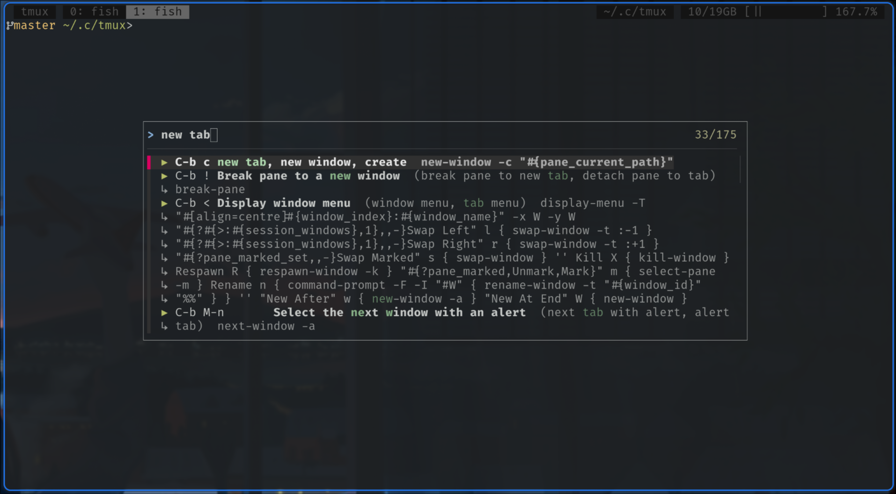

# Tmux command palette

Command palette for tmux, in the spirit of VS Code and other GUI software.

- Searchable menu to run commands
- Shows hotkeys to teach the faster way.

Trigger the palette via hotkey, type what you want — "new tab", "move pane",
hit `Enter` to execute.



## Installation

### 0. Prerequisites

- tmux 3.7+
- Systemwide python 3.11+
- [fzf](https://github.com/junegunn/fzf)
- [tpm](https://github.com/tmux-plugins/tpm)

### 1. Edit tmux config

Add the plugin to your tmux config:

```tmux
set -g @plugin 'NikolayXHD/tmux-command-palette'
```

Configure palette trigger hotkey after the tpm loader line, it should become:

```tmux
run '~/.tmux/plugins/tpm/tpm'
bind -T prefix ? tmux-command-palette
```

Alternatevely to setup VSCode-like global trigger `Ctrl + Shift + P`

```tmux
run '~/.tmux/plugins/tpm/tpm'
bind -n C-S-P tmux-command-palette
```

In that case you will need to make sure your terminal + tmux combo
is set up to properly handle `Ctrl` + `Shift` + `Key` bindings.

### 2. Trigger plugin installation

press `Prefix + I` in tmux to install the plugin.

## Development

Entry point: `palette.py`. The personal alias file is kept up to date
automatically on every palette run; the flags run that step or the checks
standalone:

- `--gen` — update `tmux-command-palette.toml`: search aliases for your custom
  bindings
- `--check` — check `palette.toml` is complete and current for this tmux
  version (every built-in command described, no stale entries)
- `--exec table|key` — run one entry's command (for testing)

Customizing aliases: edit `tmux-command-palette.toml` next to your
`tmux.conf` (e.g. `~/.config/tmux/tmux-command-palette.toml`).

Run tests: `make test`

`palette_data.py` — tmux bindings layer.

`palette_actions.py` — execution of a selected entry.

`palette_ui.py` — `fzf` UI and line rendering.

`palette.toml` — common search aliases, manually maintained in this repo.

`palette.generated.toml` — comprehensive source to build `fzf` input.

`tmux-command-palette.tmux` — tpm entry point: registers the
`tmux-command-palette` command via `command-alias[]`; the key binding is the
user's.

## AI disclosure

This plugin was vibecoded with [Pi](https://github.com/earendil-works/pi) and
deepseek-v4-flash model.
